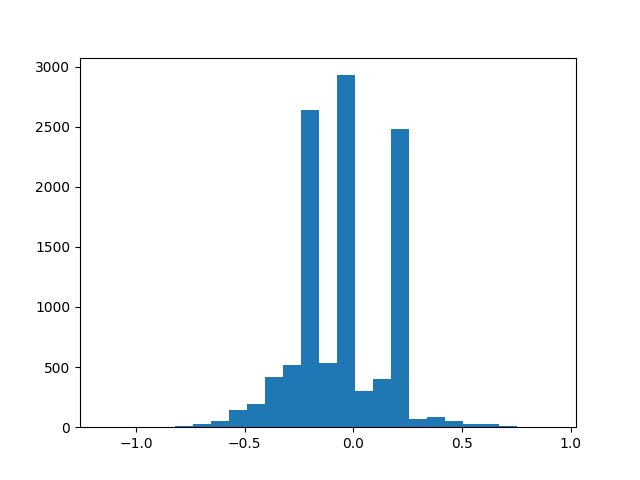
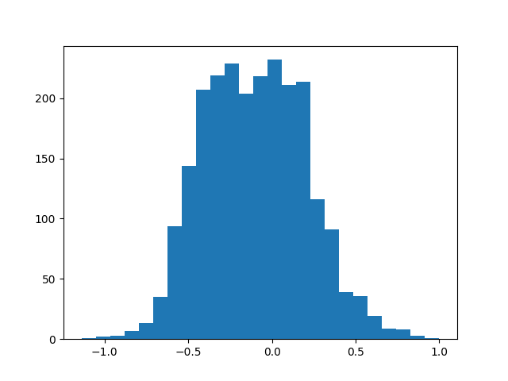
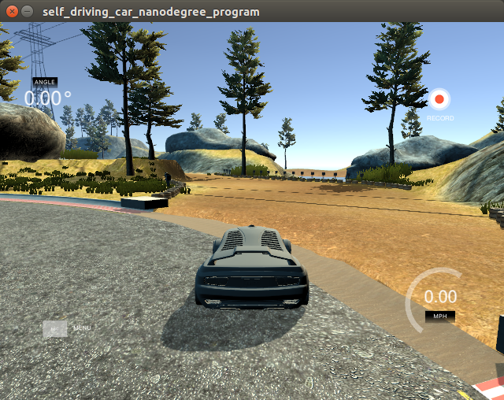

# Behavioral Cloning Project


The main goal of this project is to clone (good!) human driving behaviour on a
sumulator. This is accomplished using a convolutional neural network built using
Keras that takes images captured during a recording session and outputs the
predicted steering angles during autonomous driving.

## Rubric Points

Here I will consider the [rubric points](https://review.udacity.com/#!/rubrics/432/view) individually and describe how I addressed each point in my implementation.  

### Files Submitted & Code Quality

#### 1. Submission includes all required files and can be used to run the simulator in autonomous mode

My project includes the following files:

* `model.py` containing the script to create and train the model
* `drive.py` for driving the car in autonomous mode
* `model.h5` containing a trained convolution neural network 
* `writeup_report.md` (this file) summarizing the results

#### 2. Submission includes functional code

Using the Udacity provided simulator and my drive.py file, the car can be driven autonomously around the track by executing 

```sh
python drive.py model.h5
```

#### 3. Submission code is usable and readable

The model.py file contains the code for training and saving the convolution neural network. The file shows the pipeline I used for training and validating the model, and it contains comments to explain how the code works.

### Model Architecture and Training Strategy

#### 1. An appropriate model architecture has been employed

This is the model summary generated by Keras:

```
_________________________________________________________________
Layer (type)                 Output Shape              Param #   
=================================================================
lambda_1 (Lambda)            (None, 66, 200, 3)        0         
_________________________________________________________________
conv2d_1 (Conv2D)            (None, 31, 98, 24)        1824      
_________________________________________________________________
conv2d_2 (Conv2D)            (None, 14, 47, 36)        21636     
_________________________________________________________________
conv2d_3 (Conv2D)            (None, 5, 22, 48)         43248     
_________________________________________________________________
conv2d_4 (Conv2D)            (None, 3, 20, 64)         27712     
_________________________________________________________________
conv2d_5 (Conv2D)            (None, 1, 18, 64)         36928     
_________________________________________________________________
flatten_1 (Flatten)          (None, 1152)              0         
_________________________________________________________________
dropout_1 (Dropout)          (None, 1152)              0         
_________________________________________________________________
dense_1 (Dense)              (None, 100)               115300    
_________________________________________________________________
dense_2 (Dense)              (None, 50)                5050      
_________________________________________________________________
dense_3 (Dense)              (None, 10)                510       
_________________________________________________________________
dense_4 (Dense)              (None, 1)                 11        
=================================================================
Total params: 252,219
Trainable params: 252,219
Non-trainable params: 0
_________________________________________________________________

```

This model follows very closely to the one used in the paper titled [End to End Learning for Self-Driving Cars](https://arxiv.org/pdf/1604.07316v1.pdf). Graphically, the convolutional neural network looks like this:


The `Conv2D` layers and `Dense` layers all use ELU to introduce nonlinearity: 

```python
# convolutional and fully connected layers both use ELU to introduction nonlinearity

model.add(Conv2D(36, 5, strides=(2, 2), padding='valid', activation='elu'))
model.add(Dense(100, activation='elu'))
```

The data is normalized using the `Lambda` layer:

```python
model.add(Lambda(lambda image: image / 127.5 - 1, input_shape=(66, 200, 3), output_shape=(66, 200, 3)))
```

#### 2. Attempts to reduce overfitting in the model

The only difference is the addition of a dropout layer, right after the flatten layer, to prevent overfiting:

```
# convolution layers before
...
model.add(Dropout(0.50))
...
# fully connected layers after
```

The model contains dropout layers in order to reduce overfitting (model.py lines 21). 

#### 3. Model parameter tuning

The model used an adam optimizer, while using a smaller learning rate:

```python
model.compile(optimizer=Adam(lr=0.0001), loss='mse')
```

#### 4. Appropriate training data

Training data was chosen to keep the vehicle driving on the road. I used a combination of center lane driving and recovering from the left and right sides of the road.

For details about how I created the training data, see the next section. 

###Model Architecture and Training Strategy

#### 1. Solution Design Approach

I approached the problem by first making sure I had a "walking skeleton" working. This means knowing how to generate the data using the simulator, running it on a extremely naive neural network, and using the resulting model to run on the simulator in autonomous mode. 

Once that was done I could go an fill in the "meat", namely, choosing an appropriate convolutional network architecture and more importantly, generating data that would get the car to drive around the track.

I experimented with LeNet, AlexNet, VGG16, but finally settled the one described in the NVidia paper. I found that the NVidia model gave the most encouraging results even before I started tuning the parameters and concentrated on gathering better data.

In order to gauge how well my model was doing, I shuffled the data then set aside 10% of the data for validating. A test set is not needed since I can just run the model on the track. 

##### Obstacle 1: Turning at Bends

The first obstacle was getting the vehicle to turn at bends. A large part of this is due to the nature of the track. This is a plot of steering angles categorized into 25 bins:



Clearly, there is an over-representation of angles that constitute straight road driving. One initial idea was to use class weights. However because the steering angles where defined as floats, that was an option. 

After some experimentation, I decided to resample the data. That means computing the average number of samples per bin. If an image belongs to a under-represented bin, that image is kept. Otherwise, that image has a probability that is inversely proportional to its frequency. So if the image belongs to a bin that is over-represented, the less likely it would be kept.

This is the result from the resampling:



##### Obstacle 2: Track Confusion

I spent countless hours trying to get the car to __not__ do this:



To solve this, I turned to image preprocessing and data augmentation.

The following outlines the image prepprocessing steps:

1. The sky and the car's bonnet is cropped out
2. The image is then resized to fit the size that the network expects
3. The image is converted from RGB to YUV as outlined in the NVidia paper
4. the image is blurred to reduce noise

I then went to augment the data set. That is described in the next section.

#### 2. Creation of the Training Set & Training Process

To capture good driving behavior, I first recorded two laps on track one using center lane driving. 

The vehicle takes images from three different cameras: left, center and right. At first I used all three cameras during training, but found that I didn't get very good results. I think part of this is because it exacerbated the problem of having too many data points that represented straight road driving. Therefore, I randomly picked a camera when generating the intial data set.

To augment the data set, I employed a few techniques:

* Random left/right flipping 
* Random translations
* Random brightness

Of the three, random translations turned out to have the biggest impact on the performance of the vehicle on the track.

These were arranged in a pipeline which took the image and steering angles as parameters and returned a modified image and steering angle:

```python
def pipeline(image, steering_angle):
    image, steering_angle = translate_random(image, steering_angle)
    image, steering_angle = brightness_random(image, steering_angle)
    image, steering_angle = flip_random(image, steering_angle)

    return image, steering_angle
```

I then created function called `generator()` that would efficiently generate data only when needed:


```python
def generator(X, y, batch_size):
    X_batch = np.zeros(shape=(batch_size, 66, 200, 3), dtype=np.uint8)
    y_batch = np.zeros(shape=(batch_size, 1), dtype=np.float32)

    while True:
        for i in range(batch_size):
            index = choice(range(0, len(X)))
            X_batch[i], y_batch[i] = pipeline(X[index], y[index])

        yield X_batch, y_batch
```

The generator takes the image, steering angle data, and `batch_size` as parameters. Each invocation of the generator creates a batch of images and its corresponding steering angles by randomly picking from the training data and subjecting each pick to the `pipeline()` function as described previously.

The `generator()` is then passed as a argument to `model.fit_generator()`.

In all, the number of data points turns out to be around 3.5 million data points:

```
len(X_train) * batch_size * epochs
= 10919 * 32 * 10
= 3,494,080
``` 

#### 3. Final Thoughts

This project just goes to show that having the right data (where "right" means so many things!) is crucial, sometimes even more so than the choice neural network. Here, image processing techniques come into play. Other techniques that could also have been applied were random shearing and shadows.


#### 4. Credits

* https://chatbotslife.com/using-augmentation-to-mimic-human-driving-496b569760a9
* https://blog.keras.io/building-powerful-image-classification-models-using-very-little-data.html
* https://medium.com/@fromtheast/implement-fit-generator-in-keras-61aa2786ce98
